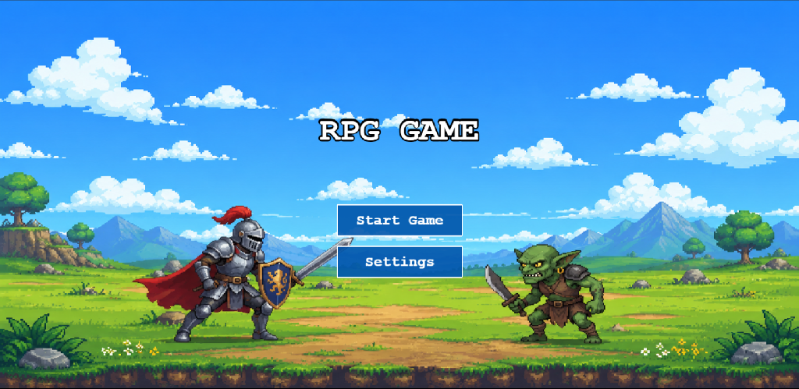
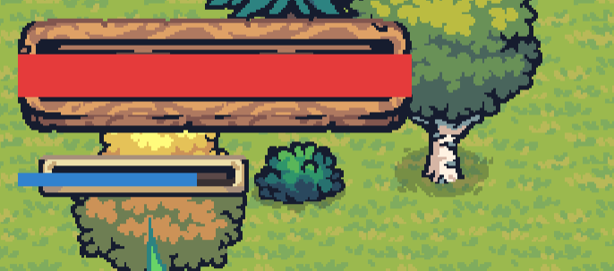
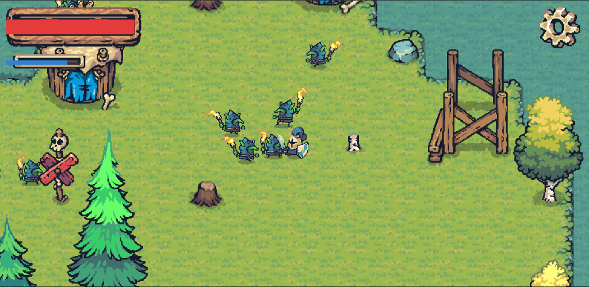
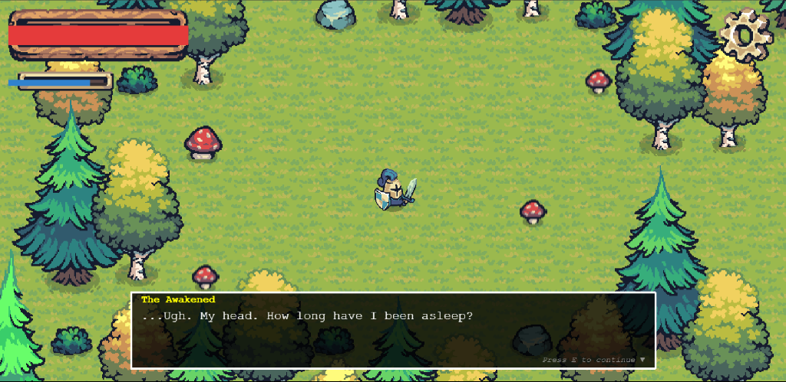

# The Shattered Banners — Liquid Galaxy RPG

[](https://phaser.io/)
[](https://www.typescriptlang.org/)
[](https://vitejs.dev/)
[](https://socket.io/)
[](https://www.liquidgalaxy.eu/)
[](https://nodejs.org/)
[](LICENSE)

> **The Shattered Banners** is a panoramic, multi-display 2D Action RPG built from the ground up with **Phaser 4**, **TypeScript**, and **Matter.js** rigid-body physics for the **Liquid Galaxy** panoramic display system. Experience real-time synchronized exploration, fast-paced melee combat, deep fantasy lore, and multi-node panoramic viewport rendering across multi-screen cluster installations.

---

## 📖 Table of Contents

- [Overview & Highlights](#overview-highlights)
- [World Lore & Narrative](#world-lore--narrative)
  - [The Prologue: Fall of the White Banner](#the-prologue-fall-of-the-white-banner)
  - [The Protagonist: The Awakened](#the-protagonist-the-awakened)
  - [The Four Warring Factions](#the-four-warring-factions)
  - [The Three-Act Campaign](#the-three-act-campaign)
  - [The Companion Squad System](#the-companion-squad-system)
- [Gameplay Mechanics & HUD Guide](#gameplay-mechanics--hud-guide)
  - [Main Menu Overview](#main-menu-overview)
  - [Health & Stamina (Mana) System](#health-stamina-mana-system)
  - [Combat, Attacks & Guarding](#combat-attacks-guarding)
  - [Dialogue & Exploration System](#dialogue-exploration-system)
  - [Inventory & Loot Collection](#inventory-loot-collection)
- [Enemies & Threat Compendium](#enemies--threat-compendium)
  - [Enemy Types & Combat Stats](#enemy-types-combat-stats)
  - [AI State Machine & Behavior Loop](#ai-state-machine-behavior-loop)
  - [Dynamic Spawner Systems](#dynamic-spawner-systems)
- [Liquid Galaxy Multi-Display Architecture](#liquid-galaxy-multi-display-architecture)
  - [Master vs Slave Responsibilities](#master-vs-slave-responsibilities)
  - [System Architecture Diagram](#system-architecture-diagram)
  - [Panoramic Camera Viewport Mathematics](#panoramic-camera-viewport-mathematics)
  - [Real-Time WebSocket Synchronization Protocol](#real-time-websocket-synchronization-protocol)
- [Installation & Setup Guide](#installation--setup-guide)
  - [Prerequisites](#prerequisites)
  - [Quick Start (Development Mode)](#quick-start-development-mode)
  - [Production Build & Deployment](#production-build-deployment)
- [Liquid Galaxy Configuration Guide](#liquid-galaxy-configuration-guide)
  - [Single-Display Mode](#single-display-mode)
  - [Dual-Display Setup](#dual-display-setup)
  - [3-Display Panoramic Rig](#3-display-panoramic-rig)
  - [5-Display Panoramic Rig](#5-display-panoramic-rig)
  - [Automated Multi-Screen Launcher Script](#automated-multi-screen-launcher-script)
- [Controls & Keybindings](#controls--keybindings)
- [Project Directory Structure](#project-directory-structure)
- [Troubleshooting & FAQ](#troubleshooting--faq)
- [License & Acknowledgments](#license--acknowledgments)

---

## 🌟 Overview & Highlights

- **Multi-Node Liquid Galaxy Synchronization**: Seamlessly scales across 1, 2, 3, or 5 physical display nodes. The master node handles physics, inputs, and AI while broadcasting lightweight delta packets over WebSocket (`port 8128`) to slave screens.
- **Mathematical Viewport Offset Algorithm**: Slaves calculate real-time world-width camera offsets (`lgOffsetX = visibleWorldWidth * multiplier`), providing a continuous, bezel-compensated panoramic view of the battlefield.
- **Matter.js Rigid-Body Physics**: Full physics simulation featuring directional knockbacks, environmental water drowning hazards, sensor triggers, and parabolic dynamite projectile arcs.
- **2D Action Combat Engine**: 50/50 combo attack variations, 80px directional slashing cones, 100% damage-absorbing shield guarding, blood explosion particle FX, and stamina management.
- **Dynamic Enemy AI**: Feral Torch Goblins (fast melee), TNT Artillery Goblins (arcing explosive dynamite with 60px AoE), and Barrel Goblins (ambush melee) driven by a 300px aggro state machine.
- **Interactive Storytelling**: NPC dialogue system, inspectable Points of Interest (POIs), rich world lore bible, and 8-slot inventory collection.

---

## 🗺️ World Lore & Narrative

### The Prologue: Fall of the White Banner

For centuries, the realm was united under the single **White Banner** hoisted above the spires of Hyrule Castle. Peace reigned across the rivers, deserts, peaks, and forests. 

A hundred years ago, a catastrophic dark sorcery known as **The Eclipse** burst from the deep catacombs beneath the castle. The dark energy corrupted the elite royal vanguard into red-eyed, relentless **Black Knights**. The capital fell in a single night. The surviving generals fled to their ancestral homelands. Stricken by fear, paranoia, and dwindling resources, the former allies turned on one another, burning the White Banner and raising four color-coded warring factions.

### The Protagonist: The Awakened

You play as **The Awakened (The Last Vanguard)**, a legendary warrior of the White Banner from the era before the collapse. Mortally wounded during the initial breach of Hyrule Castle, you were placed in enchanted stasis deep inside the *Shrine of Resurrection* on the Great Plateau. 

Awakening a century later with severe amnesia, clad in neutral traveler's garb and wielding a rusted blade, you bear the ancient crest of the White Banner etched into your soul. As the only living soul unstained by factional bloodshed, you alone possess the authority to traverse territorial borders without being struck down on sight.

```
       [ The Eclipse ] 
              │ (Corrupts Royal Vanguard into Black Knights)
              ▼
   [ Fall of Hyrule Castle ]
              │ (White Banner burns into 4 Warring Factions)
              ├───────────────────┬───────────────────┬───────────────────┐
              ▼                   ▼                   ▼                   ▼
      🔵 Blue Faction     🟡 Yellow Faction   🟣 Purple Faction   🔴 Red Faction
     (The River-Folk)    (The Desert Guard)  (Mystics of Peaks)   (The Warmongers)
              ▲                   ▲                   ▲                   ▲
              └───────────────────┴───────────────────┴───────────────────┘
                                          │
                           [ The Awakened (Protagonist) ]
                          (Must unite banners & end Eclipse)
```

### The Four Warring Factions

| Faction | Title & Realm | Iconic Units | Stance & Dilemma |
| :--- | :--- | :--- | :--- |
| 🔵 **Blue Banner** | **The River-Folk**<br>*(Zora's Domain, Lanayru, Lake Hylia)* | Lancers & Monks | Peaceful, isolationist faction whose crystalline waterways are being secretly poisoned by infiltrating Black Knights. |
| 🟡 **Yellow Banner** | **The Desert Guard**<br>*(Gerudo Desert, Kara Kara Bazaar)* | Archers & Warriors | Proud, mercantile guardians facing devastating famine after the Red Faction severed the southern trade routes through Faron. |
| 🟣 **Purple Banner** | **The Mystics of the Peaks**<br>*(Hebra Mountains, Ancient Tech Labs)* | Monks & Pawns | Cloistered scholars studying ancient Sheikah relics to reverse The Eclipse; willing to forge powerful artifacts for the player. |
| 🔴 **Red Banner** | **The Warmongers (Antagonists)**<br>*(Death Mountain, Eldin, Lost Woods)* | Heavy Warriors & Archers | Power-hungry warlords who forged a dark pact with feral Goblin hordes to plunder rival territories and seize the ruins of Hyrule. |

### The Three-Act Campaign

1. **Act 1: The Awakening**: Awaken in the Shrine of Resurrection. Clear roaming Goblin scouts from the plateau, discover the ruined Temple of Time, meet the surviving mine scavenger, and descend to the lowlands.
2. **Act 2: The Shattered Alliances**: Traverse the regional territories, solve critical faction crises (purifying the Blue waterways, reopening the Yellow trade caravan, securing Purple arcane research), and assault Death Mountain to sever the Red Faction-Goblin alliance.
3. **Act 3: The Siege of Hyrule**: Unify the four banners into a grand coalition army, lead the allied vanguard across the Great Hyrule Field, breach the gates of Hyrule Castle, defeat the corrupted Black Knights, and seal The Eclipse forever.

### The Companion Squad System

As you earn the trust of each faction leader, you unlock specialized AI companions that can be summoned into your vanguard:
- 🔵 **Blue Spearman**: High-mobility melee zoning and enemy pushback.
- 🟡 **Yellow Archer**: Long-range sniper support and aerial coverage.
- 🟣 **Purple Monk**: Area-of-effect healing runes and damage-mitigation buffs.

---

## ⚔️ Gameplay Mechanics & HUD Guide

### Main Menu Overview



The game launches into an animated title screen featuring the pixel-art landscape of Hyrule. 
- **Start Game**: Initializes the primary game loop, loads tilemaps, and spawns the player at the starting coordinates.
- **Settings**: Allows tuning display parameters, audio levels, and diagnostic controls.
- **Liquid Galaxy Sync**: In multi-display setups, slave screens display a synchronized `"Waiting for Master Screen to Start Game..."` status overlay and automatically transition into the world the moment the master starts the game.

---

### Health & Stamina (Mana) System



The HUD is rendered in the top-left corner of the viewport (scaled 2x for readability) within ornamental wooden status frames:

```
┌────────────────────────────────────────────────────────┐
│  ❤️ HEALTH BAR (#e53b3b) — Max 100 HP                  │
└────────────────────────────────────────────────────────┘
┌───────────────────────────────┐
│  ⚡ STAMINA BAR (#3182ce) — 100│
└───────────────────────────────┘
```

#### Vitality & Health Mechanics
- **Maximum Health**: `100 HP` (rendered as a vibrant red fill `#e53b3b`, max width `176px`).
- **Taking Damage**: When struck by enemy melee attacks (5 DMG), dynamite explosions (12 DMG), or debug triggers (`K` key: 10 DMG), the player sprite flashes red (`0xff0000`) for 100ms.
- **Water Hazard & Drowning**: Stepping into deep water collisions immediately inflicts `20 DMG`, followed by a repeating timer inflicting `20 DMG every 600ms`. If health drops to zero while submerged, the player plays a custom water splash animation (`play_water_splash`) before triggering death.
- **Death Screen ("YOU DIED")**: Reaching `0 HP` triggers a red semi-transparent screen overlay (`0x880000` at 70% opacity) pausing physics and offering two choices:
  1. **Restart**: Respawn immediately at the map spawn point with full 100 HP and 100 Stamina.
  2. **Quit to Main Menu**: Return to the title screen.

#### Stamina (Mana) Mechanics
- **Maximum Stamina**: `100 Stamina` (rendered as an azure blue fill `#3182ce`, max width `80px`).
- **Attack Cost**: Executing a basic sword attack requires and consumes `20 Stamina` (`consumeMana(20)`). If stamina is below 20, attack inputs are locked.
- **Regeneration Rate**: Regenerates automatically at **+10 Stamina per second** (+10 every 1000ms) up to the 100 cap whenever the player is not actively draining stamina.

---

### Combat, Attacks & Guarding



Combat in *The Shattered Banners* is fast-paced, positioning-focused, and momentum-driven:

#### 1. Attack Combos (`Spacebar`)
- **Randomized Combo Variety**: Pressing `Spacebar` randomly executes either **Attack 1** (atlas frames 14–17 @ 12 fps) or **Attack 2** (atlas frames 18–21 @ 12 fps) with a 50/50 distribution.
- **Directional Hitbox**: Calculates a forward-facing attack cone with an effective range of **80px** (`attackRange = 80`). Attacks only connect with enemies positioned in front of the player (`facingRight === isEnemyRight`).
- **Damage & Knockback**: Each successful strike deals **20 Damage** to the target enemy, triggers a blood burst particle effect (15 particles), and applies a knockback impulse of **velocity 5** along the impact angle.

#### 2. Defensive Guarding (`Shift` Key)
- Holding the `Shift` key puts the player into a locked **Guard Stance**.
- **100% Damage Absorption**: While in guard stance, all incoming melee hits and ranged explosive projectiles are completely absorbed without dealing damage.
- Movement is halted while guarding to encourage strategic timing between offensive strikes and defensive recovery.

---

### Dialogue & Exploration System



- **Proximity Interactions (`E` Key)**: When within `80px` of friendly NPCs or `60px` of Points of Interest (POIs), an interaction indicator appears.
- **Dialogue Overlay**: Features typewriter text animation, custom character avatars, and prompt pagers (`"Press E to continue ▼"`).
- **Inspectable Points of Interest**:
  - **Broken Castle Ruins**: Ancient fortifications shattered during The Eclipse, now infested by goblin raiders.
  - **Broken Watchtowers**: Former vantage points containing scavenged resources and tactical vantage lore.
  - **Goblin Skull Totems**: Feral markers indicating active goblin territory and nearby spawner huts.

---

### Inventory & Loot Collection

- **Inventory Grid (`I` Key)**: Toggles an 8-slot interactive inventory grid overlay, pausing background physics while managing gear.
- **Gold Coin Drops**: Defeated enemies emit a golden spawn burst (`g_spawn`) and drop bouncing gold coins (`g_idle`). Stepping over coins triggers a Matter.js sensor, broadcasts a `coin_pickup` event to all screens, and increments your inventory treasury.

---

## 👹 Enemies & Threat Compendium

```
  ┌──────────────────┐       ┌──────────────────┐       ┌──────────────────┐
  │   Torch Goblin   │       │    TNT Goblin    │       │  Barrel Goblin   │
  │  (Melee Raider)  │       │ (Ranged Bomber)  │       │ (Ambush Trooper) │
  │ 50 HP | 5 Damage │       │ 50 HP | 12 AoE   │       │ 50 HP | 5 Damage │
  └──────────────────┘       └──────────────────┘       └──────────────────┘
```

### Enemy Types & Combat Stats

| Enemy Archetype | Sprite Atlas / Key | HP | Speed | Attack Range | Damage | Cooldown | Combat Behavior |
| :--- | :--- | :--- | :--- | :--- | :--- | :--- | :--- |
| **Torch Goblin** | `enemy_goblin_torch_blue` | 50 | 1.5 | 40px | 5 Melee | 1500ms | Fast melee skirmisher wielding a burning torch. Charges player on sight, winds up for 300ms, and strikes within 60px tolerance. |
| **TNT Goblin** | `enemy_goblin_tnt_blue` | 50 | 1.5 | 220px | 12 AoE | 2500ms | Ranged artillery unit. Throws spinning dynamite sticks on a parabolic arc (`arcHeight = 50px`, speed = 4) causing 60px radius AoE explosions. |
| **Barrel Goblin** | `enemy_goblin_barrel_blue` | 50 | 1.5 | 40px | 5 Melee | 1500ms | Ambush troop disguised inside a wooden barrel. Pops out when player approaches and attacks with rapid melee slashes. |
| **Black Knight** | `corrupted_black_knight` | 250 | 0.8 | 60px | 25 Heavy | 2000ms | Elite corrupted royal vanguard. High health pool, devastating heavy slash, and high knockback resistance. Guards Hyrule Castle perimeter. |

### AI State Machine & Behavior Loop

All enemies operate on a real-time distance-based state machine evaluated in `src/entities/enemy.ts`:

```
                 [ Player Distance > 300px ]
                             │
                             ▼
                     ┌───────────────┐
                     │   IDLE STATE  │ (Enemy stops, plays Idle anim)
                     └───────┬───────┘
                             │ [ Distance <= 300px ]
                             ▼
                     ┌───────────────┐
                     │  CHASE STATE  │ (Moves towards player @ Speed 1.5)
                     └───────┬───────┘
                             │ [ Distance <= Attack Range ]
                             ▼
                     ┌───────────────┐
         ┌──────────>│ ATTACK STATE  │ (Winds up & executes attack)
         │           └───────┬───────┘
         │                   │ (Trigger attack animation / projectile)
         │                   ▼
         │           ┌───────────────┐
         └───────────┤ COOLDOWN WAIT │ (Plays Idle until cooldown expires)
   (Cooldown passed) └───────────────┘
```

1. **Idle State (`dist > 300px`)**: If the player is outside the 300px aggro radius, the enemy halts movement and plays idle animations to save processing cycles.
2. **Chase State (`attackRange < dist <= 300px`)**: The enemy computes the normalized direction vector towards the player, flips its sprite along the X-axis accordingly, and pursues at `speed = 1.5`.
3. **Attack State (`dist <= attackRange`)**:
   - **Melee (40px)**: Halts movement, plays attack animation, and inflicts 5 damage after a 300ms windup window.
   - **Ranged (220px)**: Launches an arcing dynamite projectile that detonates upon reaching target coordinates.
4. **Hit Reaction**: When struck, the enemy flashes bright red (`0xff0000`), takes knockback velocity of 5, and plays blood burst particle emitters.

### Dynamic Spawner Systems

- **Goblin House Spawners**: Proximity spawners located near goblin huts. When player steps within `200px`, the hut spawns 1 goblin per second up to a cap of 4–6 active goblins.
- **Zone Mob Spawners**: Territory area spawners that activate when the player enters a `600px` radius, maintaining up to 5 active mobs every 5000ms interval.

---

## 🖥️ Liquid Galaxy Multi-Display Architecture

Liquid Galaxy is a multi-screen panoramic display installation. *The Shattered Banners* utilizes a distributed Master-Slave network architecture to synchronize panoramic rendering across multiple client machines or browser windows.

### Master vs Slave Responsibilities

| Subsystem | Master Screen (`?screen=1` / Center) | Slave Screens (`?screen=2..5` / Side Displays) |
| :--- | :--- | :--- |
| **Physics Engine** | Full Matter.js rigid-body physics simulation | Physics collisions disabled (visual display node) |
| **Player Input** | Full keyboard, mouse, and gamepad capture | Input listeners suppressed |
| **HUD Overlay** | Renders full UI (Health, Stamina, Inventory, Dialog) | UI overlay hidden for clean panoramic immersion |
| **Enemy AI & Spawners** | Executes full AI loops, aggro checks & spawns | Mirrors enemy positions, frames, and animations |
| **Projectiles & Coins** | Computes trajectories, impacts, and pickups | Renders visual copies via WebSocket broadcast |
| **Camera Controller** | Centered directly on player position | Follows player with calculated panoramic offset & lerp |

---

### System Architecture Diagram

```
+---------------------------------------------------------------------------------------------------------+
|                                           NODE.JS SERVER                                                |
|                                    (Express 5 + Socket.io :8128)                                        |
|                                                                                                         |
|       - Serves static assets from ./dist                                                                |
|       - Relays events from Master to all Slaves via socket.broadcast.emit(...)                          |
+----------------------------------------------------+----------------------------------------------------+
                                                     |
                                  +------------------+------------------+
                                  | WebSocket Delta Synchronization     |
                                  +------------------+------------------+
                                                     |
          +--------------------+---------------------+---------------------+--------------------+
          |                    |                                           |                    |
          v                    v                                           v                    v
  +---------------+    +---------------+                           +---------------+    +---------------+
  |    SLAVE 4    |    |    SLAVE 5    |       MASTER SCREEN       |    SLAVE 2    |    |    SLAVE 3    |
  |  (Far Left)   |    |   (Left 1)    |         (Center)          |   (Right 1)   |    |  (Far Right)  |
  |  ?screen=4    |    |  ?screen=5    |        ?screen=1          |  ?screen=2    |    |  ?screen=3    |
  | Offset: -2W   |    | Offset: -1W   |        Offset: 0          | Offset: +1W   |    | Offset: +2W   |
  | (HUD Hidden)  |    | (HUD Hidden)  |      (Full HUD & AI)      | (HUD Hidden)  |    | (HUD Hidden)  |
  +---------------+    +---------------+                           +---------------+    +---------------+
```

---

### Panoramic Camera Viewport Mathematics

To ensure seamless alignment across multi-monitor panoramic rigs, slave nodes compute horizontal camera follow offsets based on display width and camera zoom:

$$\text{visibleWorldWidth} = \frac{\text{camera.width}}{\text{camera.zoom}}$$

$$\text{lgOffsetX} = \text{visibleWorldWidth} \times \text{screenMultiplier}$$

$$\text{camera.setFollowOffset}(\text{lgOffsetX}, 0)$$

#### Multiplier Lookup Table (5-Screen Rig):
- **Screen 1 (Master / Center)**: $\text{Multiplier} = 0 \implies \text{Offset} = 0\text{px}$
- **Screen 2 (Right 1)**: $\text{Multiplier} = +1 \implies \text{Offset} = +1 \times \text{visibleWorldWidth}$
- **Screen 3 (Far Right)**: $\text{Multiplier} = +2 \implies \text{Offset} = +2 \times \text{visibleWorldWidth}$
- **Screen 4 (Far Left)**: $\text{Multiplier} = -2 \implies \text{Offset} = -2 \times \text{visibleWorldWidth}$
- **Screen 5 (Left 1)**: $\text{Multiplier} = -1 \implies \text{Offset} = -1 \times \text{visibleWorldWidth}$

---

### Real-Time WebSocket Synchronization Protocol

The master node emits lightweight state updates over Socket.io at 60 Hz to ensure low latency:

| Socket Event | Direction | Payload Structure | Functional Purpose |
| :--- | :--- | :--- | :--- |
| `player_update` | Master $\to$ Slaves | `{ x: float, y: float, anim: string, flipX: bool }` | Synchronizes player position (rounded to 1 decimal place), current animation frame, and facing direction. |
| `enemy_update` | Master $\to$ Slaves | `{ id: string, x: float, y: float, texture: string, anim: string, flipX: bool, isDead: bool }` | Synchronizes enemy positions, textures, animations, and death states across screens. |
| `projectile_spawn` | Master $\to$ Slaves | `{ startX: number, startY: number, targetX: number, targetY: number }` | Spawns visual dynamite projectile following identical parabolic trajectory on slave screens. |
| `explosion_spawn` | Master $\to$ Slaves | `{ x: number, y: number }` | Triggers synced explosion animation and particle emitter at target detonation coordinates. |
| `coin_spawn` | Master $\to$ Slaves | `{ id: string, x: number, y: number }` | Spawns visual bouncing gold coin entity at loot drop position. |
| `coin_pickup` | Master $\to$ Slaves | `{ id: string }` | Destroys collected coin on all screens simultaneously. |
| `map_transition` | Master $\to$ Slaves | `{ mapKey: string, spawnName: string }` | Synchronizes map changes with a unified 1000ms camera fade transition. |
| `start_game` | Master $\to$ Slaves | `{}` | Transitions all slave screens from title screen into gameplay simultaneously. |
| `game_pause` / `resume` | Master $\to$ Slaves | `{}` | Pauses or resumes Matter.js engine and animations across all displays. |
| `game_restart` | Master $\to$ Slaves | `{}` | Resets scenes, player health, and spawner pools upon game over restart. |
| `quit_to_main` | Master $\to$ Slaves | `{}` | Navigates all screens back to `MainMenuScene`. |

---

## 🚀 Installation & Setup Guide

### Prerequisites

- **Node.js**: Version `18.0.0` or higher (`node -v`)
- **npm**: Version `9.0.0` or higher (`npm -v`)
- **Modern Web Browser**: Google Chrome, Chromium, or Mozilla Firefox with WebGL enabled.

### Quick Start (Development Mode)

```bash
# 1. Clone the repository
git clone https://github.com/LiquidGalaxyLAB/RPGgame_for_liquidGalaxy.git
cd RPGgame_for_liquidGalaxy

# 2. Install dependencies
npm install

# 3. Start development servers
# Concurrently launches the Node Socket.io relay server (:8128) and Vite HMR dev server (:5173)
npm run dev
```

Open your browser to:
- **Master Screen**: [http://localhost:5173?screen=1](http://localhost:5173?screen=1) (or simply [http://localhost:5173](http://localhost:5173))
- **Left Slave Screen**: [http://localhost:5173?screen=5](http://localhost:5173?screen=5)
- **Right Slave Screen**: [http://localhost:5173?screen=2](http://localhost:5173?screen=2)

---

### Production Build & Deployment

```bash
# 1. Compile TypeScript and build production bundle into dist/
npm run build

# 2. Launch production Express server
npm start
```

The production server will be running on `http://localhost:8128`.

---

## 🎛️ Liquid Galaxy Configuration Guide

Configure screen roles using URL query parameters:

### Single-Display Mode
```
http://localhost:5173/
```
Runs standalone with full HUD, physics simulation, keyboard controls, and centered camera.

---

### Dual-Display Setup
- **Master (Left Screen)**: `http://localhost:5173/?screen=1&screens=2`
- **Slave (Right Screen)**: `http://localhost:5173/?screen=2&screens=2`

---

### 3-Display Panoramic Rig
- **Left Display**: `http://localhost:5173/?screen=5&screens=3` (Offset: $-1\times \text{Width}$)
- **Center Display (Master)**: `http://localhost:5173/?screen=1&screens=3` (Offset: $0$)
- **Right Display**: `http://localhost:5173/?screen=2&screens=3` (Offset: $+1\times \text{Width}$)

---

### 5-Display Panoramic Rig

```
┌──────────────┐ ┌──────────────┐ ┌──────────────┐ ┌──────────────┐ ┌──────────────┐
│   SCREEN 4   │ │   SCREEN 5   │ │   SCREEN 1   │ │   SCREEN 2   │ │   SCREEN 3   │
│   Far Left   │ │    Left 1    │ │ Master Center│ │   Right 1    │ │  Far Right   │
│ ?screen=4    │ │ ?screen=5    │ │ ?screen=1    │ │ ?screen=2    │ │ ?screen=3    │
└──────────────┘ └──────────────┘ └──────────────┘ └──────────────┘ └──────────────┘
```

1. **Screen 4 (Far Left)**: `http://<MASTER_IP>:8128/?screen=4`
2. **Screen 5 (Left 1)**: `http://<MASTER_IP>:8128/?screen=5`
3. **Screen 1 (Master / Center)**: `http://<MASTER_IP>:8128/?screen=1`
4. **Screen 2 (Right 1)**: `http://<MASTER_IP>:8128/?screen=2`
5. **Screen 3 (Far Right)**: `http://<MASTER_IP>:8128/?screen=3`

---

### Automated Multi-Screen Launcher Script

For Liquid Galaxy multi-rig installations on Linux / Ubuntu machines, use the following bash script to launch all 5 screens in Google Chrome kiosk mode across monitors:

```bash
#!/bin/bash
# Liquid Galaxy 5-Screen Launch Script
MASTER_IP="127.0.0.1:8128"

google-chrome --kiosk --user-data-dir=/tmp/lg_screen_4 --window-position=0,0 "http://${MASTER_IP}/?screen=4" &
google-chrome --kiosk --user-data-dir=/tmp/lg_screen_5 --window-position=1920,0 "http://${MASTER_IP}/?screen=5" &
google-chrome --kiosk --user-data-dir=/tmp/lg_screen_1 --window-position=3840,0 "http://${MASTER_IP}/?screen=1" &
google-chrome --kiosk --user-data-dir=/tmp/lg_screen_2 --window-position=5760,0 "http://${MASTER_IP}/?screen=2" &
google-chrome --kiosk --user-data-dir=/tmp/lg_screen_3 --window-position=7680,0 "http://${MASTER_IP}/?screen=3" &
```

---

## 🎮 Controls & Keybindings

| Action | Primary Key | Secondary / Alternate Key | Behavior \& Notes |
| :--- | :--- | :--- | :--- |
| **Move Up** | `W` | `Up Arrow` | Moves player north (`speed = 3`) |
| **Move Down** | `S` | `Down Arrow` | Moves player south (`speed = 3`) |
| **Move Left** | `A` | `Left Arrow` | Moves player west; flips sprite (`flipX = true`) |
| **Move Right** | `D` | `Right Arrow` | Moves player east; resets sprite flip (`flipX = false`) |
| **Basic Attack** | `SPACEBAR` | `J` | Consumes 20 Stamina; plays Attack 1/2 combo; 80px forward cone; 20 DMG |
| **Guard / Block** | `SHIFT` (Hold) | — | Holds defensive stance; absorbs 100% damage from all attacks |
| **Interact / Advance** | `E` | — | Interacts with nearby NPCs (within 80px), inspects POIs, advances dialogue |
| **Inventory Grid** | `I` | — | Toggles 8-slot inventory overlay and pauses game |
| **Pause / Settings** | `ESC` | `P` | Opens pause settings menu; pauses physics and timers |
| **Debug Damage** | `K` | — | Inflicts 10 damage to player (for testing health & death flow) |

---

## 📁 Project Directory Structure

```
rpg-game-lg/
├── .agents/                    # Multi-agent coordination metadata & reports
├── dist/                       # Compiled production bundle (HTML, JS, assets)
├── docs/                       # Documentation assets
│   └── images/                 # Gameplay screenshots & HUD graphics
│       ├── combat.png          # Combat encounter with goblin raiders
│       ├── gameplay.png        # In-game dialogue & exploration scene
│       ├── hud_closeup.png     # Health & Stamina HUD detailed view
│       └── menu.png            # Main menu & title screen
├── public/                     # Static game assets (audio, fonts, tilemaps)
│   ├── animations/             # Sprite atlas JSON definitions
│   ├── buildings/              # Building tilesets and sprites
│   ├── dialog/                 # Story dialog script JSON files
│   ├── effects/                # Explosions, water splash, and blood particles
│   ├── maps/                   # Tiled JSON world maps (ui_map.json, map1.json)
│   ├── npc/                    # Friendly NPC spritesheets
│   ├── resources/              # Gold coins, timber, and resource pickups
│   └── terrain/                # Ground tilesets, bridges, bushes, and decor
├── scripts/                    # Build, verification, and testing scripts
│   ├── audit_verifier.cjs      # Comprehensive system integrity test suite
│   ├── copy_assets.cjs         # Screenshot asset ingestion utility
│   └── test_suite.cjs          # Unit and integration test runner
├── src/                        # TypeScript source code
│   ├── animations/             # Animation loaders (player, enemies, effects)
│   ├── constants/              # Asset keys, constants, and event definitions
│   ├── entities/               # Game entity classes
│   │   ├── enemy.ts            # Enemy AI state machine, combat, and drops
│   │   ├── player.ts           # Player movement, attacks, health, stamina, guard
│   │   └── projectile.ts       # Parabolic dynamite projectile physics
│   ├── scenes/                 # Phaser game scenes
│   │   ├── BootScene.ts        # Preload & asset bootstrapping
│   │   ├── DeathMenuScene.ts   # Game over & respawn screen
│   │   ├── game.ts             # Main gameplay scene, physics, LG networking
│   │   ├── MainMenuScene.ts    # Title screen & LG slave waiting screen
│   │   ├── PauseMenuScene.ts   # In-game pause menu
│   │   └── UIScene.ts          # Fixed HUD rendering (Health & Stamina bars)
│   ├── ui/                     # UI components (DialogBox, Inventory, Buttons)
│   └── main.ts                 # Phaser game configuration & initialization
├── HOW_TO_RUN.md               # Quick execution instructions
├── index.html                  # HTML5 entry point
├── package.json                # Project dependencies & scripts
├── render.yaml                 # Cloud deployment configuration
├── server.js                   # Node.js + Express + Socket.io relay server
├── story_lore_bible.txt        # Official game lore, history & faction bible
├── tsconfig.json               # TypeScript compiler configuration
└── vite.config.ts              # Vite bundler configuration
```

---

## ❓ Troubleshooting & FAQ

### Q1: The slave screens are not updating or moving when the master moves.
- **Check Server Connection**: Ensure the Node.js server is running (`node server.js` or `npm run dev` on port `8128`).
- **Check WebSocket Logs**: Open browser Developer Tools (`F12` $\to$ Console) on both master and slave windows. Master should log `Socket connected as Master` and Slaves should log `Socket connected as Slave (Screen X)`.
- **Firewall**: If running on separate physical machines across a local network, ensure port `8128` is open in the master machine's firewall.

### Q2: The camera view on the slave screens is clipping or misaligned.
- **Verify Screen Numbers**: Ensure each screen has a unique query parameter: `?screen=1` (Center/Master), `?screen=2` (Right), `?screen=5` (Left).
- **Match Resolutions**: Ensure all displays are set to matching resolutions (e.g. 1920x1080) and zoom levels in browser settings (100% zoom).

### Q3: My basic attacks are not executing when I press Spacebar.
- **Check Stamina**: Basic attacks cost `20 Stamina`. If your blue stamina bar is empty, wait for it to regenerate (+10/sec).
- **Check Animation Lock**: Attacks cannot interrupt an ongoing attack or guard animation.

### Q4: The game screen is black or assets fail to load.
- **Check Asset Paths**: Ensure the dev server is launched from the project root.
- **WebGL Support**: Verify that hardware acceleration is enabled in Chrome settings (`chrome://settings/system`).

---

## 📜 License & Acknowledgments

### License
This project is open-source software licensed under the **[MIT License](LICENSE)**.

### Acknowledgments
- **[Liquid Galaxy Project](https://www.liquidgalaxy.eu/)** & **Google Summer of Code** for supporting panoramic interactive experiences.
- **[Phaser Studio](https://phaser.io/)** for the incredible Phaser HTML5 game engine.
- **Pixel Art Creators & Open-Source Community** for the fantasy sprites and environment tilesets.
